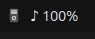
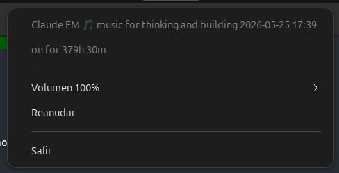

# claudefm-tray

Indicador en la barra superior de GNOME para escuchar la radio [claudeFM](https://github.com/sanhuaaan/claudefm) sin tener que dejar abierta una terminal.

| En la barra superior | Menú al hacer clic |
|---|---|
|  |  |

## Qué hace

- Reproduce el stream HLS de YouTube en segundo plano vía `yt-dlp` + `mpv`.
- Pinta un icono `♪` en la barra superior con el porcentaje de volumen al lado: `♪ 100%`.
- Menú con: título del stream, "on for Xh", control de volumen (submenú radio 0/25/50/75/100/125), pausa/reanudar, **cambiar URL** y salir.
- **Scroll del ratón sobre el icono** → ±5% de volumen.
- **Teclas multimedia del teclado** (Play/Pause, etc.) funcionan vía MPRIS si tienes instalado `mpv-mpris`.
- **Auto-reconexión**: las URLs HLS de YouTube caducan cada ~6h; cuando mpv muere, la app la vuelve a resolver y relanza sola.


## Instalación

```bash
./install.sh
```

El script:

1. `sudo apt install` de las dependencias del sistema (ver tabla más abajo).
2. `uv venv --python /usr/bin/python3 --system-site-packages` — el venv hereda PyGObject del sistema porque instalarlo desde PyPI requiere toolchain de C y los GIR typelibs.
3. `uv sync --inexact` para instalar el paquete en modo editable.
4. Copia `claudefm-tray.desktop` a `~/.config/autostart/` para arranque en cada sesión.

## Configuración

Una sola pieza: escribe la URL de la radio en `~/.config/claudefm/url`:

```bash
mkdir -p ~/.config/claudefm
echo "https://www.youtube.com/watch?v=YmQ7jRgf4f0" > ~/.config/claudefm/url
```

(es el ID del directo de Claude FM en mayo 2026; cambialo si rota).

Cuando el directo caduca (YouTube los marca como privados/finalizados), no hace
falta editar el fichero a mano: usa **«Cambiar URL…»** en el menú del icono. Pega
la nueva URL, se guarda en `~/.config/claudefm/url` y la app vuelve a resolver y
reproducir al momento.

## Ejecutar

```bash
uv run claudefm-tray
# o tras instalar:
.venv/bin/claudefm-tray
```

Tras reiniciar sesión arranca solo desde el autostart.

## Parar

Clic derecho en el icono → **Salir**. O `pkill claudefm-tray`.

## Dependencias

| Paquete apt | Para qué | Obligatorio |
|---|---|---|
| `yt-dlp` | Resolver la URL HLS de YouTube | sí |
| `mpv` | Reproducir el HLS | sí |
| `python3-gi` | Bindings Python ⇄ GLib | sí |
| `gir1.2-gtk-3.0` | Typelibs GTK3 | sí |
| `gir1.2-ayatanaappindicator3-0.1` | API del tray icon | sí |
| `gnome-shell-extension-appindicator` | Render del icono en GNOME | sí |
| `mpv-mpris` | Teclas multimedia del teclado | recomendado |

`yt-dlp` debe ser **reciente** (las builds de apt suelen estar viejas y YouTube devuelve 403). Si pasa, instalar con `pipx install yt-dlp` o `uv tool install yt-dlp`.

## Créditos

La idea, el formato del archivo de URL y el statusline de viewers/sparkline en terminal vienen del proyecto original de [sanhuaaan/claudefm](https://github.com/sanhuaaan/claudefm). Este proyecto es una reimplementación independiente en forma de aplicación GTK de bandeja, sin fork ni código compartido.

## Licencia

MIT.
